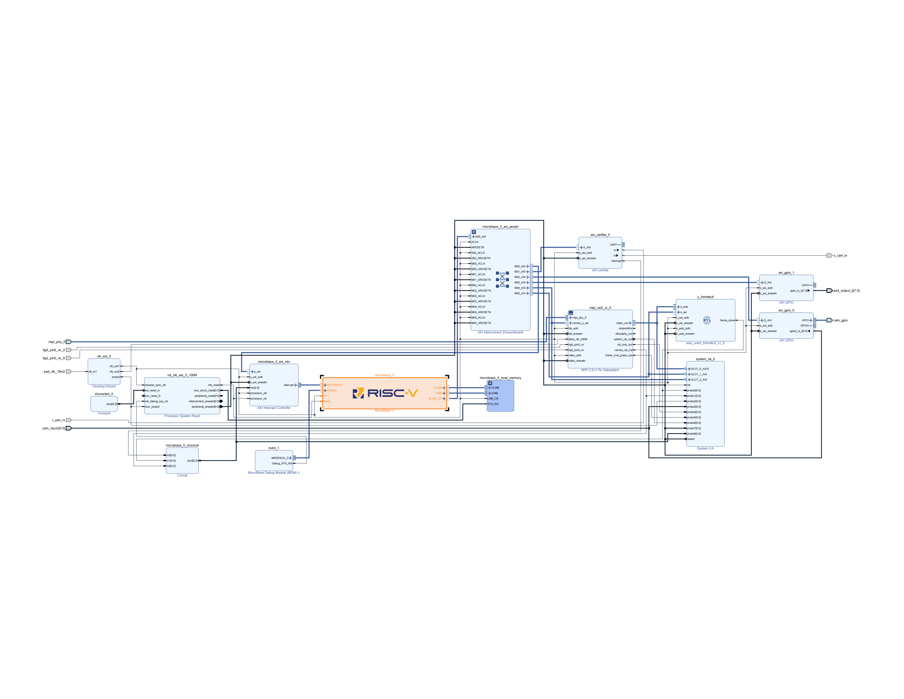
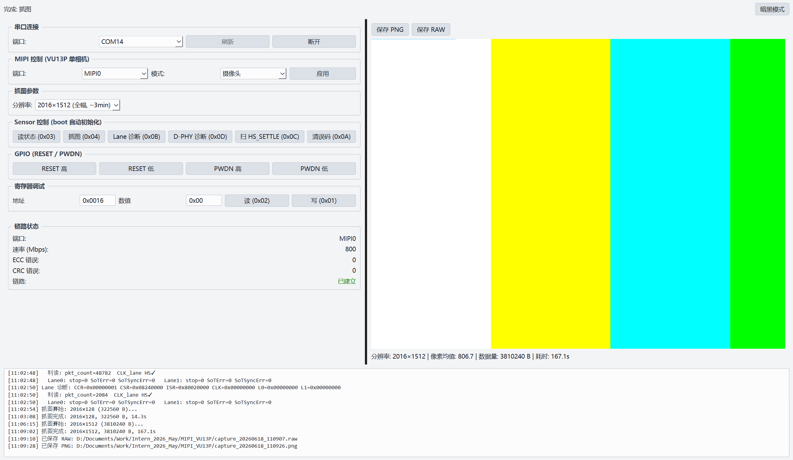

# MIPI_VU13P

基于 Xilinx VU13P 的 MIPI 相机图像采集系统：从传感器配置、CSI-2 接收、帧缓存到 PC 端解码与联调，覆盖 Vivado 硬件集成与 Vitis 嵌入式固件开发的完整链路。

## 概述

本仓库实现一条可复现的 **2-Lane MIPI CSI-2 RAW10** 采集通路。FPGA 侧使用官方 MIPI CSI-2 RX Subsystem 完成 D-PHY 解串与协议解析；MicroBlaze 固件通过 GPIO bit-bang I2C 完成传感器初始化与出流控制；采集帧写入 URAM 帧缓冲后，经 UART 分块回传至上位机进行 RAW10 解码与显示。

当前基线输出为 **2016×1512 @ ~21 fps**（2-Lane RAW10）。系统支持链路状态查询、Lane/D-PHY 寄存器诊断、HS_SETTLE 在线扫描等联调手段，便于定位时钟/数据 Lane 同步与采样窗口类问题。

## 数据通路

```
传感器 (I2C)          MIPI CSI-2 RX           URAM 帧缓冲          UART            上位机
─────────────    ─────────────────────    ───────────────    ──────────    ─────────────────
寄存器配置   →   D-PHY HS + CSI-2 解包  →  AXIS 写入缓存  →  分块传输  →  RAW10 解码 / GUI
PG 测试图        ECC/CRC 统计              单帧 ARM/DONE        230400 baud     行宽诊断脚本
```

**协议层要点**

- **CSI-2**：2 数据 Lane + 1 时钟 Lane；RAW10 短包格式；接收端通过子系统 CSR/ISR 统计包计数与 ECC/CRC。
- **D-PHY**：关注时钟 Lane Stop→HS 切换（LinkUp 判据）、数据 Lane 的 HS_SETTLE 采样窗口、SoT/同步错误标志；支持运行时读写 per-lane HS_SETTLE 并扫描有效区间。
- **传感器侧**：I2C 寄存器表驱动模式切换（分辨率、帧率、测试图）；输出几何须与上位机解码行宽一致，否则会出现行 stride 错位。

## Block Design

Vivado 工程 `mipi_platform`：MicroBlaze 经 AXI 访问 UART/GPIO、CSI-2 RX 控制寄存器与 URAM 帧缓冲；MIPI `video_out` 直连帧缓冲写端口，System ILA 用于联调抓取。



## 上位机

PySide6 验证平台：串口连接、链路状态、RAW10 抓图与 Bayer 预览、Lane/D-PHY 诊断与 HS_SETTLE 扫描；抓图宽度与 sensor 行宽对齐，避免 stride 错位。



## 工具链与协同方式

| 阶段 | 工具 | 内容 |
|------|------|------|
| 硬件集成 | **Vivado** | `create_project.tcl` 一键生成工程与 Block Design：时钟/MicroBlaze、CSI-2 RX、URAM 帧缓冲、ILA、AXI 外设 |
| 约束与实现 | **Vivado** | 板级 XDC（UART/GPIO/时钟）；MIPI 引脚由 IP Pin Assignment 管理；综合/实现/比特流 |
| 平台导出 | **Vivado → XSA** | 导出硬件规格，供 Vitis 生成 BSP 与地址映射 |
| 固件开发 | **Vitis** | MicroBlaze 裸机应用：协议解析、命令分发、I2C/Sensor、帧抓取与 UART 发送 |
| 联调分析 | **上位机** | PySide6 GUI + Python 协议库；Windows / Linux 均可运行（见 `tools/README.md`） |

典型工作流：Tcl 重建 BD → 综合实现 → 导出 XSA → Vitis 编译固件 → 上板后用 GUI/脚本完成抓图与链路诊断。

## 仓库结构

```
fpga/
  constraints/vu13p_pins.xdc.template  # 板级管脚约束模板（可提交）
  constraints/vu13p_pins.xdc           # 本地填写，已 gitignore
  rtl/axis_uram_framebuf.v    # AXIS → URAM 帧缓冲
  scripts/                    # Vivado 工程/BD 构建、DRC、MIPI 引脚辅助脚本
  vivado/                     # Vivado 工程（BD、IP 配置）
  vitis/
    mipi_platform/            # Vitis 硬件平台（由 XSA 生成）
    mipi_fw/src/              # 固件源码（协议、传感器、图像发送）
tools/                        # 上位机：lib / gui / scripts / tests
```

固件 UART 命令涵盖寄存器读写、链路状态、单帧抓取、GPIO 控制、Lane/D-PHY 诊断、HS_SETTLE 设置等；命令格式与上位机 `tools/lib/protocol.py` 一致。

## 快速开始

**依赖**：Vivado / Vitis（与目标器件 `xcvu13p-fhga2104` 版本匹配）、Python 3.10+。

```bash
# 0. 板级管脚（首次克隆后）
cp fpga/constraints/vu13p_pins.xdc.template fpga/constraints/vu13p_pins.xdc
# 按本机原理图填写 PIN_* 变量（该文件不纳入版本库）

# 1. 生成 Vivado 工程（需已安装 Vivado）
vivado -mode batch -source fpga/scripts/create_project.tcl

# 2. 在 Vivado 中综合、实现、生成比特流并导出 XSA

# 3. Vitis 中导入 XSA，编译 mipi_fw，下载至板卡

# 4. 上位机
cd tools && pip install -r requirements.txt
./run_gui.sh          # Linux / macOS
# run_gui.bat         # Windows
```

CLI 工具（行宽反推、HS_SETTLE 扫描、寄存器批量下发）用法见 [tools/README.md](tools/README.md)。

## 联调能力

- **链路状态 (0x03)**：D-PHY 线速率、ECC/CRC 累计、时钟 Lane HS 状态
- **Lane 诊断 (0x0B)**：CSI-2 RX 子系统 CCR/CSR/ISR 与各 Lane 信息寄存器
- **D-PHY 诊断 (0x0D)**：per-lane Mode / InitDone / CalibComplete / HSAbort / 包计数
- **HS_SETTLE 扫描 (0x0C)**：在线扫描采样窗口，定位「有时钟 HS、数据 Lane 有活动但零包」类问题
- **RAW 行宽诊断**：`tools/scripts/find_stride.py` 从抓图文件反推实际行 stride，排查解码宽度与 sensor 输出不一致

## 声明

- 传感器厂商寄存器表、板级原理图等受版权或保密协议约束的文件**未包含在本仓库**；固件中的初始化表仅为个人联调所用配置，不代表厂商推荐设置。
- 工程中使用的 Xilinx IP 与第三方库遵循其各自许可条款；仓库源码仅供技术交流与个人学习参考。
- 请勿在公开渠道传播未脱敏的硬件序列号、内部文档路径或未授权的原理图资料。
